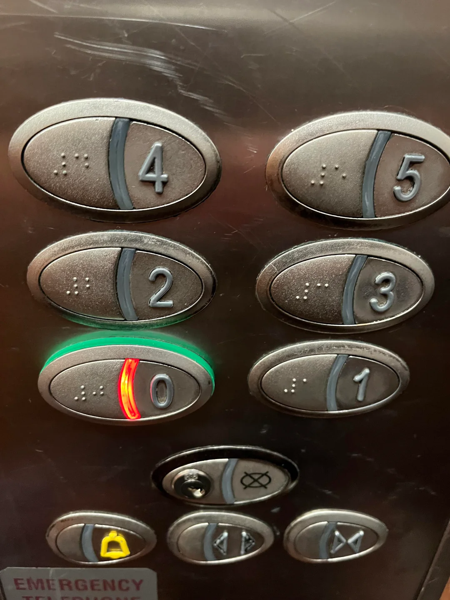

# Enumerate

In Python, we often need to loop through a list and keep track of both the index (the position) and the item itself. 

A common pattern from which we all start to track the index is using `range(len(...))` and indexing back into the list:

```python
hallway = ["goblin", "empty", "chest", "dragon"]

for i in range(len(hallway)):
    room = hallway[i]
    print(f"Room {i}: {room}")
```

While this works, Python offers a cleaner, more readable, and pythonic way to achieve this: **`enumerate()`**.

## The Syntax

The `enumerate()` function takes an iterable (like a list) and returns an enumerate object. It yields pairs containing the index starting from 0 (like european elevators) and the corresponding item.



```python
for index, item in enumerate(iterable):
    # Do something with index and item
```

## Traditional Loop vs Enumerate

Let's compare the two approaches:

### Traditional Loop with range(len(...))
```python
inventory = ["potion", "shield", "sword"]

for i in range(len(inventory)):
    item = inventory[i]
    print(f"Slot {i}: {item}")
```

### Enumerate Approach
```python
inventory = ["potion", "shield", "sword"]

for i, item in enumerate(inventory):
    print(f"Slot {i}: {item}")
```

Using `enumerate()` is much cleaner because you don't have to manually index into the list with `inventory[i]`. It provides both the index and the item in a single, readable line.

# Assignment

A local band of goblins is hiding in various rooms along a hallway. As the team's scout, your job is to identify the indexes of all rooms containing a goblin.

Complete the `track_goblin_rooms` function. It takes a list of room contents (`hallway`) and should return a new list containing the room numbers (indexes) where a goblin is present:

- [ ] Use `enumerate` to loop over the `hallway` list.
- [ ] Find all rooms where the content is exactly `"goblin"`.
- [ ] Return a list of the indexes of those rooms.

## Tips

- Remember the syntax of `enumerate`:
  ```python
  for index, item in enumerate(iterable):
  ```
